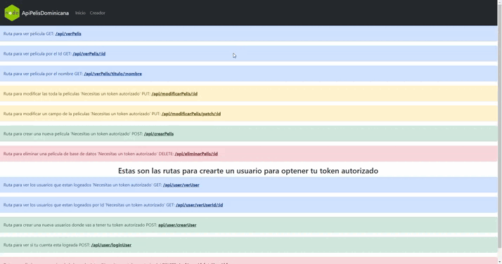

<!-- Please update value in the {}  -->

<h1 align="center">API Peliculas Dominicanas</h1>

<div align="center">
   Solution for a challenge from  <a href="http://devchallenges.io" target="_blank">Devchallenges.io</a>.
</div>

<div align="center">
  <h3>
    <a href="https://api-peliculas-do.herokuapp.com/">
      Demo
    </a>
    <span> | </span>
    <a href="https://stackoverflow.com/">
      Solution
    </a>
    <span> | </span>
    <a href="https://developers.google.com/youtube/v3">
      Challenge
    </a>
  </h3>
</div>

<!-- TABLE OF CONTENTS -->

## Table of Contents

- [Overview](#overview)
  - [Built With](#built-with)
- [Features](#features)
- [How to use](#how-to-use)
- [Contact](#contact)
- [Acknowledgements](#acknowledgements)

<!-- OVERVIEW -->

## Overview


<!--  -->

### Built With

<!-- This section should list any major frameworks that you built your project using. Here are a few examples.-->

- [Node.js](https://nodejs.org/es/)
- [Express](https://expressjs.com/es/)
- [MongoDB](https://www.mongodb.com/es)

## Features

<!-- List the features of your application or follow the template. Don't share the figma file here :) -->

This Api was created to deliver the data of all the movies that have been originally made in the Dominican Republic, such as its name, creator, genre, cast, creation date, movie cover and the URL where you can see the movie completely free.

## How To Use

<!-- Example: -->

To clone and run this application, you'll need [Git](https://git-scm.com) and [Node.js](https://nodejs.org/en/download/) (which comes with [npm](http://npmjs.com)) installed on your computer. From your command line:

```bash
# Clone this repository
$ git clone https://github.com/imanol309/api-peliculas-do.git

# Install dependencies
$ npm install

# Run the app
$ npm start
```

## Acknowledgements

<!-- This section should list any articles or add-ons/plugins that helps you to complete the project. This is optional but it will help you in the future. For example: -->

- [Steps to replicate a design with only boostrap](https://getbootstrap.com/)
- [Node.js](https://nodejs.org/)
- [Mongoose](https://mongoosejs.com/docs/api.html)

## Contact

- Website [api-peliculas-do](https://api-peliculas-do.herokuapp.com/)
- GitHub [imanol309](https://github.com/imanol309)
- Instagram [imanolp7](https://www.instagram.com/imanolp7/)

